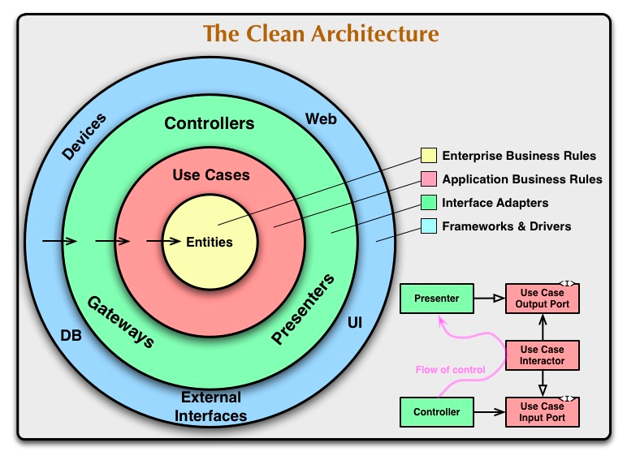

# 02. 의존성 역전하기

### TL;DR
- [ ] 단일책임 원칙을 `한가지 일만 하는`에서 `변경할 이유`로 해석해서 이해하자
- [ ] 컴포넌트간의 의존성이 강할 수록 단일책임 원칙을 위반하고, 컴포넌트를 변경할 더 많은 이유가 생기고 어려워 진다.
- [ ] 의존성 역전 원칙으로 변경할 이유의 갯수를 줄여보자.
- [ ] 서드파티 라이브러리에 의존적인 것은 의존성 역전을 시킬 수 없다
- [ ] 클린 아키텍처
- [ ] 헥사고날 아키텍처는 클린 아키텍처의 구체적인 모델이다
### 단일 책임 원칙

> ~~하나의 컴포넌트는 오로지 한가지 일만 해야 하고, 그것을 올바르게 수행해야 한다.~~
>
> 컴포넌트를 변경하는 이유는 오직 하나뿐이어야 한다.

`단일책임` 이란, 오로지 한가지 일을 하는 것 이라는 직관적 해석이지만, 실제 정의는 `변경할 이유`로 해석해야 한다.

단일변경이유원칙(Single Reason to Change Principle)이 더 맞는 말일 수도 있다.

아키텍처에서 단일책임 원칙은, `어떤 다른 이유로` 소프트웨어를 변경하더라도 기대한 대로 동작할 것이다 라는 것을 말한다. 하지만 그 이유라는건 의존성을 통해 너무도 쉽게 서로 컴포넌트로 전달된다.

많은 코드는 단일책임 원칙을 위반하고 있고, 시간이 지날수록, 컴포넌트를 변경할 더 많은 이유가 생기고 변경하기 더 어려워 진다. 그래서 컴포넌트의 교체가 어려워 진다.

### 부수효과에 관한 이야기

### 의존성 역전 원칙

계층형 아키텍처에서 계층간 의존성은 항상 아래를 가리킨다. 단일책임 원칙을 고수준에서 적용할 때, 그래서 상위 계층이 하위 계층에 비해 변경할 이유가 더 많아진다.
**즉, 영속성 계층을 변경할 때 마다 잠재적으로 도메인 계층도 변경해야 한다.**
이런 문제를 의존성 역전 원칙으로 해결할 수 있다

의존성 역전 원칙 (Dependency Inversion Principle)
> 코드상의 어떤 의존성이든 그 방향을 바꿀 수 있다.

사실 의존성의 양쪽 코드를 모두 제어할 수 있을 때만 의존성을 역전시킬 수 있다.

- ex) 서드파티 라이브러리에 의존성이 있다면, 해당 라이브러리 제어를 할 수 없기에 이 의존성을 역전할 수 없다.

**도메인 코드와 영소성 코드 간의 의존성을 역전시켜보자. 그리고 도메인 코드를 변경할 갯수를 줄여보자**

1. 도메인에서 영속성 계층의 엔티티와, 레퍼지토리모두 의존한다면, **엔티티를 도메인 계층으로 올린다.**
2. 레포지토리 계층의 코드가 도메인 계층의 엔티티를 의존하기 때문에, 순환 의존이 생긴다.
3. 2의 순환 의존을 해결하기 위해 DIP를 적용한다. 도메인 계층에 리포지토리 인터페이스를 만들고, 실제 리포지토리는 영속성 계층에서 구현하도록 하는 것이다.

**이 방법이 클린 아키텍처, 헥사고날 아키텍처의 핵심 기능이다.**

### 클린 아키텍처

> 설계가 비즈니스 규칙의 테스트를 용이하게 하고, 비즈니스 규칙은 프레임워크, 데이터베이스, UI기술, 그 밖의 외부 애플리케이션이나 인터페이스로부터 독립적일 수 있다.
> 이는 **도메인 코드가 바깥으로 향하는 어떤 의존성도 없어야 함을 의미한다.** 대신 DIP의 도움으로 모든 의존성이 도메인 코드를 향하고 있다.

**클린 아키텍처의 특징**

- 모든 의존성은 도메인 로직을 향해 안쪽 방향으로 향한다.
- 아키텍쳐의 코어에는 주변 유스케이스에서 접근하는 도메인 엔티티 들이 있다.
    - 코어: 도메인계층과 애플리케이션 계층을 합쳐 application core라 부름
- 유스케이스는 앞에서 서비스라고 불렸던 것인데, 단일책임을 위해 좀 더 세분화 돼 있다. (넓은 서비스 문제 피하기)
- 코어를 주변으로 비즈니스 규칙을 지원하는 애플리케이션의 다른 모든 컴포넌트를 확인할 수 있다. `지원`은 영속성을 제공하거나, UI를 제공하는 것을 의미한다. 바깥쪽 계층들은 다른 서드파티 컴포넌트에 어댑터를
  제공할 수 있다.
- 도메인 코드에서는 어떤 영속성 프레임워크, UI프레임워크가 사용되는지 알 수 없기 때문에 프레임워크 특화된 코드를 가질 수 없다. 그리고 비즈니스 규칙에 집중할 수 있다.
- 도메인을 자유롭게 모델링 할 수 있다.
- 부수적인 대가도 따른다.
    - 엔티티의 대한 모델링을 각 계층에서 유지보수 해야한다.
    - 영속성 계층에서 사용한 ORM 모델링 엔티티를 도메인 계층에서 사용할 수 없고, 두 계층에서 각각 엔티티를 만들어야 한다.
    - 모든 계층에서 마찬가지다.
    - 하지만 이는 바람직한 일이다. 결합이 제거되기 떄문이다. (ex. orm에서 강제하는 파라미터 없는 생성자를 도메인 모델에선 생각하지 않아도 된다.)
        - 8장에서 `매핑하지 않기 전략`을 비롯한 것들을 살펴보자
- 클린 아키텍쳐의 추상성을 좀더 구체적으로 그린것이 `육각형 아키텍쳐`다.

### 육각형 아키텍처(헥사고날 아키텍처)

- 애플리케이션 코어가 육각형으로 표현되어 이름이 유래 되었다.
- 애플리케이션이 다른 시스템이나 어댑터와 연결되는 4개 이상의 면을 가질 수 있음을 보여주기 위해 의도했다.
- 육각형 안에는 도메인 엔티티와 이와 상호작용하는 유스케이스가 있다.
- 육각형에서 외부로 향하는 의존성이 없기 때문에 클린아키텍처에서 제시한 규칙이 그대로 적용된다. 대신 모든 의존성은 코어를 향한다.
- 육각형 바깥은 애플리케이션과 상호작용 하는 다양한 어댑터가 있다.(웹어댑터, 외부시스템, 영속성 어댑터)
    - 왼쪽 어댑터는 애플리케이션을 주도하는 어댑터들이다. (애플리케이션 코어를 호출하기 때문에)
    - 오른쪽 어댑터 들은 애플리케이션에 의해 주도되는 어댑터 들이다. (애플리케이션 코어에 의해 호출되기 때문에.)
- 코어와 어댑터들 간의 통신이 가능하려면, 애플리케이션 코어가 각각 포트를 제공해야 한다.
    - 주도하는 어댑터(driving adapter)는, 포트가 코어에 있는 유스케이스 클래스들에 의해 구현되고 호출되는 인터페이스가 될 것.
    - 주도되는 어댑터(driven adapter)는, 포트가 어댑터에 의해 구현되고 코어에 의해 호출되는 인터페이스가 될 것이다.
- 이 때문에 포트와 어댑터 아키텍쳐라고도 부른다
- 육각형 아키텍처도 계층으로 구성할 수 있다.
    - 어댑터: 가장 바깥쪽에 위치한 계층. 애플리케이션과 다른 시스템간 번역을 담당한다.
    - 애플리케이션 계층: 포트와 유스케이스 구현체를 결합해서 구성. 인터페이스를 정의하기 떄문이다
    - 도메인: 도메인 엔티티 계층
- 참조: https://alistair.cockburn.us/hexagonal-architecture/

### 유지보수 가능한 소프트웨어를 만드는데 어떻게 도움이 될까?
- 도메인 코드가 바깥에 의존하지 않게 함으로써, 영속성과 UI에 특화된 모든 문제로부터 도메인 로직의 결합을 제거하고 코드를 변경할 이유의 수를 줄일 수 있다.
- 변경이 적을 수록 유지보수성은 좋아진다.

