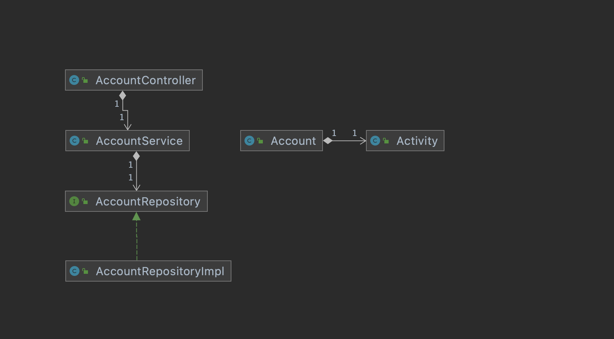

# 03. 코드 구성하기

### TL;DR

- [ ] 육각형 아키텍처를 직접적으로 반영하는 패키지 구조 파악하기

---
패키지 구조는 짜임새 없는 엉망진창 코드를 그럴싸하게 보이게 하는 껍데기... 목적잃은 패키지는 구조적인척 하게 보여주는 역할을 하지, 구조가 있다고 할 수 없다. 한 패키지에 있는 클래스가 `불러오지 말아야할`
다른 패키지를 불러오는 것을 조심하자.

## `송금하기 유스케이스`를 통해 패키지 구조화 방법들을 살펴보기.

### 1.계층으로 구성하기

- 웹 계층: web
- 도메인 계층: domain
- 영속성 계층 : persistence

3-layer archtecture를 기본으로 생각하고 작성한다.

의존성 역전 원칙을 적용해서 `의존성이 domain으로만 향하도록` 코드를 구성한다

- 도메인 패키지에 `AccountRepository` 인터페이스를 두고, persistence 패키지에 `AccountRepositoryImpl` 을 둬서 의존성을 역전시시켰다 -> Repository 레이어의
  변동이 있을 때, AccountRepository로 인해서 AccountService가 변동에 의존하지 않게 된다.

- 세가지 이유로 이 패키지는 최적의 구조가 아니다.
    1. 애플리케이션의 기능 조각(functional slice)이나 특성(feature)을 구분짓는 패키지 경계가 없다.
        - e.g. 사용자 관리를 추가한다면..? 추가적 구조가 없다면 서로 연관되지 않은 기능들끼리 부수효과를 일으킬 수 있는 묶음으로 변모하기 쉽다.
    2. 애플리케이션이 어떤 유스케이스를 제공하는지 파악할 수 없다. 해당 서비스내의 어떤 메서드가 책임을 수행하는지 찾아야 한다.
    3. 패키지 구조로 목표로 하는(헥사고날아키텍쳐) 아키텍처를 파악할 수 없다.
        - 어떤 기능이 web에서 호출되는지, 어떤기능이 영속성에서 받아오는지 파악할 수 없다.

나는 & 팀 코드는 Repository란 이름의 인터페이스가 항상 영속성 레이어에 있었다. repository가 interface화 되어 있긴 하지만, 기존엔 이런 의존성 역전을 위함이 아니라 단순 구현체의 역할?
을 하고 있는게 더 큰거 같다. -> Repository란 이름이 도메인으로 오게 되는게 어색하긴 한데, 그러면 기존 JPA repository명을 다 변경하는게 맞을까. 아니면 구분되는 이름을 사용하는게 맞을까.

### 2.기능으로 구성하기

- `1.계층으로구성하기`의 모든 코드를 최상위 패키지 account로 넣었다. 패키지를 없앴다.
- 패키지 외부에서 접근되면 안되는 클래스는 package-private으로 경계를 강화할 수 있다. -> 불필요한 의존성을 방지할 수 있다.
- 송금하기 유스케이스를 보여주기 위해 AccountService를 SendMoneyService로 이름을 변경한다 (`screaming architecture`)
- 하지만 기능에 의한 패키징 방식은 `가시성을 훨씬 더 떨어뜨린다`. 어댑터 패키지명, 인커밍, 아웃고잉 포트 확인할 수 없다.
    - 심지어 도메인코드와 영속성 코드간의 의존성을 역전시켰음에도 불구하고, package-private 접근 수준을 이용해 도메인 코드가 영속성 코드에 의존하는 것을 막을 수 없다.
    - **?? RepositoryImpl을 public으로 보통 작성하진 않나보다..!? 고민해볼것..**

### 3. 아키텍쳐적으로 표현력 있는 패키지 구조

- 육각형 아키텍처에서 구조적 핵심 요소는 엔티티, 유스케이스, 인커밍/이웃고잉 포트, 인커밍/아웃고잉(주도하거나 주도되는) 어댑터다.
- 구조의 각 요소는 패키지 하나씩에 직접 매핑된다.
    - 최상위: account
    - 도메인: domain
    - 어플리케이션 패키지는 **도메인 모델을 둘러싼 서비스 계층을 포함한다.**
        - **SendMoneyService**는 `인커밍 포트 인터페이스인 SendMoneyUseCase`를 구현
        - 아웃고잉 인터페이스이자 `영속성 어댑터에 의해 구현된 LoadAccountPort`와 `UpdateAccountStatePort`를 사용한다.
        - adapter 패키지는 애플리케이션의 계층의 `인터밍 포트를 호출하는 인커밍 어댑터`와 애플리케이션 계층의 `아웃고잉 포트의 대한 구현을 제공하는 아웃고잉 어댑터를 포함한다.`
- 위의 패키지 구조는 `아키텍처-코드 갭` 혹은 `모델-코드갭`을 효과적으로 다룰 수 있는 강력한 요소다. 이런 용어는 대부분의 소프트웨어 개발 프로젝트에서 **아키텍처가 코드에 직접 매핑될 
  수 없는 추상적 개념이라는 사실을 보여준다.**
- 표현력 있는 패키지 구조는 아키텍처에 대한 적극적 사고를 촉진한다. 많은 패키지가 생기고 현재 작업중인 코드를 어디에 넣어야 할지 생각해야 하기 떄문이다.      
- 어댑터 패키지에 대해서는, 모든것을 public으로 만들어서 패키지간의 접근을 허용하지 않아도 된다. 어댑터 패키지의 코드들은 application 패키지의 port 인터페이
  스를 통하지 않고선 바깥에서 호출되지 않기 때문에 package-private 접근 수준으로 둬도 된다. **우발적 의존성을 만들지 않아도 된다.**
- application 패키지와 domain 패키지의 일부 클래스들은 public으로 지정해야 한다. 의도적으로 adapter에서 접근 가능해야 하는 포트들은 public 이어야 한다.
- domain 클래스들은 서비스, 잠재적으로는 어댑터에서도 접근이 가능하도록 public 이어야 한다.
- 서비스는 in-coming 포트 인터페이스 뒤에 있기에 public 일 필요가 없다.
- 하나의 어댑터를 다른 구현체로도 쉽게 바꿀 수 있다. 변경이 필요한 아웃고잉 어댑터 들만 새로운 어댑터 패키지에 구현하고 기존 패키지를 지우면 된다.
- DDD 개념에 직접 대응시킬 수 있다.
    - 예제 코드에서는 account 같은 상위레벨 패키지는 다른 바운디드 컨텍스트와 통신할 전용 진입점과 출구를 포함하는 바운디드 컨텍스트에 해당된다.
    - domain 패키지 내에서는 DDD가 제공하는 모든 도구를 이용해 원하는 어떤 도메인 모델이든 만들 수 있다.
    
### 의존성 주입 역할

- 애플리케이션 계층이 in-coming/out-going 어댑터에 의존성을 갖지 않는 것이다.
- 웹 어댑터 같은 인커밍 어댑터에 대해서는 거렇게 하기가 쉽다. (제어 흐름의 방향이 어댑터와 도메인 코드 간의 의존성 방향과 같은 방향이기 때문이다.)
- 애플리케이션 계층으로 진입점을 구분짓기 위해 실제 서비스를 포트 인터페이스들 사이에 숨겨두고 싶을 수 있다 ( SendUseCase 이용한거 아닌가.!>)
- **영속성 어댑터와 같이 아웃고잉 어댑터에 대해서는 제어흐름의 반대방향으로 의존성을 돌리기 위해 의존성 역전 원칙을 이용해야 한다.**
    - 애플리케이션 계층에 인터페이스를 만들고, 어댑터에 해당 인터페이스를 구현한 클래스를 두면 된다.
    - 애플리케이션에서 위의 설명에 해당하는 인터페이스는 포트다.
    - **포트 인터페이스를 구현한 실제 객체를 누가 애플리케이션 계층에 제공해야 할까?** => 모든 계층의 의존성을 가진 중립 컴포넌트를 하나 도입한다.
    - 예제의 중립 의존성 주입 컴포넌트는 `AccountController`, `SendMoneyService`, `AccountPersistenceAdapter`
        > p.31 SendMoneyService 인스턴를 만들떄도 의존성 주입 메커니즘이 LoardAccountPort 로 가장한 AccountPersistenceAdapter 클래스의 인스턴스를 주입할 것이다...???
        > 이 인용을 구현하려면 어떻게 해야할까..

